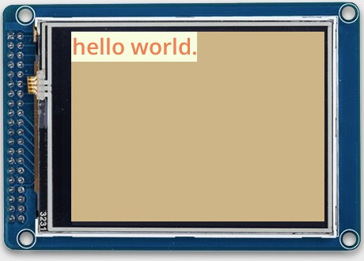
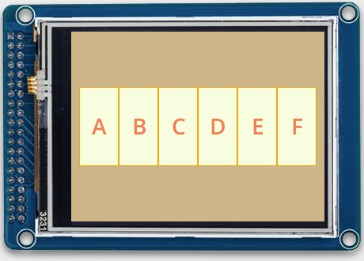
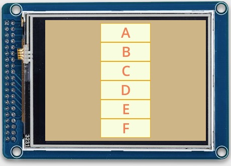

# Moddable SDKのUI関連の実装例についてのメモ

公式ドキュメントだけでは分からない挙動を、実際に動作させて理解するための実装例。

実装例をPCのシミュレータで実行した画面と、実装時に分かったことのメモ。

## ラベルでhelloworldを表示する 

### 概要

- フォントを利用して文字を表示するために必要な`manifest.json`ファイルの設定
- `Label Object`を利用するための準備(フォントの指定方法)
- `Label Object`の表示位置指定(left,top)
- `Application Object`へのコンテンツ(ラベル)の追加

### メモ

**Application Object**

`Application Object`は`Container Object`から派生している。

`Application Object`の`top,left,bottom,right`属性および`height,width`属性は設定に関係なく全画面になる。

`Application Object`の`contents`属性は縦や横に自動整列されない。表示位置は追加するコンテンツで設定する。

**Label Object**

`Label Object`で`top,left,bottom,right`属性および`height,width`属性を省略しても、表示する文字分の高さ幅は確保される。

以下はLabel以外の`Content Object`で共通だと思われる。

- `top,botom`属性を指定すると、上下に指定した分だけのマージンが取られる。
- `top,botom`属性を省略すると、縦方向でセンタリングされる。

- `left,right`属性を指定すると、左右に指定した分だけマージンが取られる。
- `left,right`属性を省略すると、横方向でセンタリングされる。

## コンテンツ(ラベル)を横に並べる

### 概要

- `Row Object`を利用して、自動で横に並べる
- `Label Object`に枠を付ける方法(`Skin Object`の`stroke,borders`属性で設定)

### メモ

**Row Object**

`Row Object`に追加した全てのコンテンツの高さや幅が画面サイズを超えた場合、入り切らなかったコンテンツが見切れる。

- `Row Object`を横方向にセンタリグしている場合、左右が見切れる。
- `Row Object`の`left`属性を指定した場合、右端が見切れる。

## コンテンツ(ラベル)を縦に並べる

### 概要

- `Column Object`を利用して、自動で横に並べる

### メモ

**Column Object**

`Column Object`に追加した全てのコンテンツの高さや幅が画面サイズを超えた場合、入り切らなかったコンテンツが見切れる。

- `Column Object`を縦方向にセンタリグしている場合、上下が見切れる。
- `Column Object`の`top`属性を指定した場合、下部が見切れる。

